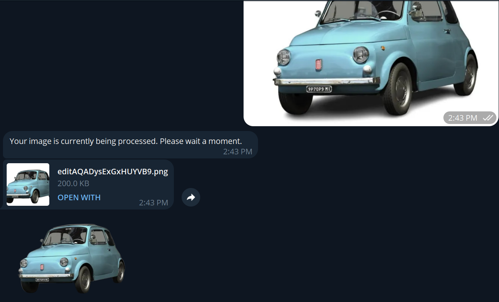
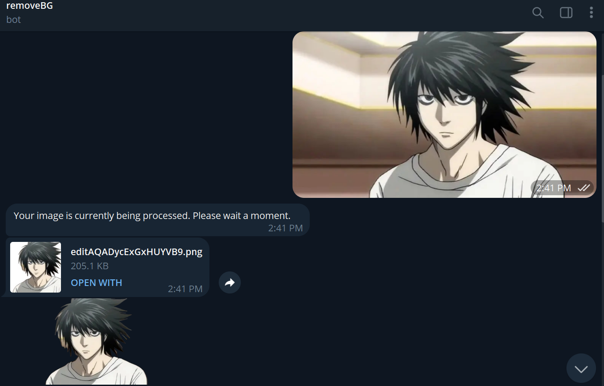

# Telegram Background Removal Bot

The Telegram Background Removal Bot helps you remove backgrounds from images right within your Telegram chats! It's your assistant, making your images stand out by removing their backgrounds effortlessly.

## Features

- **Background Removal**: Easily remove backgrounds from images sent to the bot.
- **Supports Various File Types**: Works with both photos and documents (images) sent via Telegram.
- **Send Back Results**: Sends back the processed image as both a document and a sticker for convenience.

## Example Results

Here are a couple of examples of the bot's results:

### Example 1


### Example 2


Feel free to send your own images to the bot and see the magic happen!

## Installation

To start using the Telegram Background Removal Bot, follow these simple steps:

1. **Clone the Repository:**

   ```bash
   git clone https://github.com/your-username/Telegram-Background-Removal-Bot.git
   ```

2. **Install Dependencies:**

   Navigate to the cloned repository directory and install the required dependencies:

   ```bash
   cd Telegram-Background-Removal-Bot
   pip install -r requirements.txt
   ```

3. **Set Up Your Telegram Bot Token:**

   Replace `TOKEN` in the code with your actual Telegram bot token.
   Don't forget to change the paths to the right folders.

## Usage

1. **Run the Bot:**

   Start the bot by running the Python script:

   ```bash
   python bot.py
   ```

2. **Send an Image:**

   Send an image to the bot to initiate the background removal process.

3. **Wait for Results:**

   The bot will process the image and send back the resulting image as a document and a sticker.

## Contributing

Contributions are welcome! If you want to contribute to this project, follow these steps:

1. Fork the repository.
2. Create a new branch (`git checkout -b feature/your-feature-name`).
3. Make your changes.
4. Commit your changes (`git commit -am 'Add new feature'`).
5. Push to the branch (`git push origin feature/your-feature-name`).
6. Create a new Pull Request.

## Feedback

Have ideas or issues? Share them in the issues section. Let's make this bot even better!
``` 

Feel free to adjust any details according to your project's specifics.
